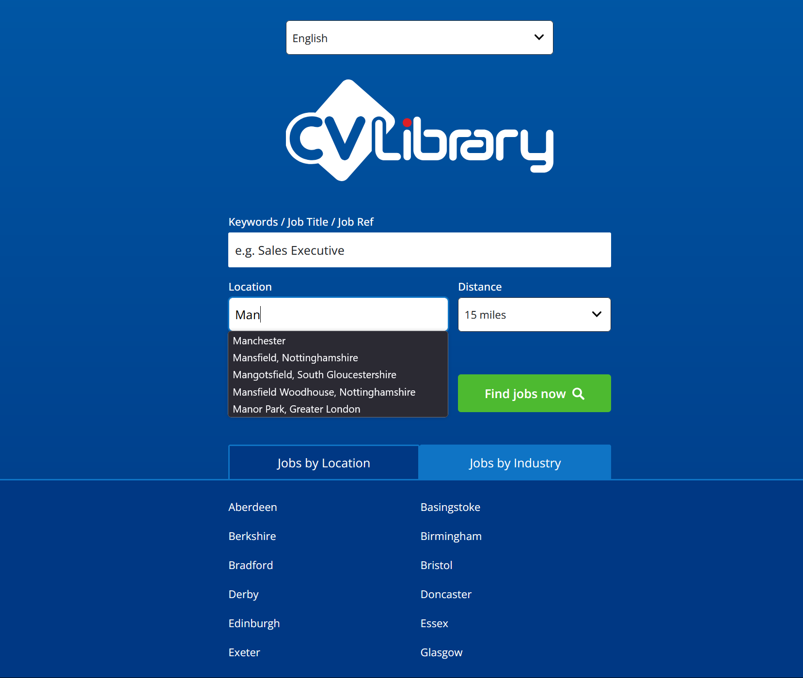

# CV Library Job Search

A modern job search interface built with Next.js 15, showcasing React Server Components, intelligent URL-driven state management using NUQS, and a comprehensive UI design system. The application enables users to search for jobs by location or industry with real-time location suggestions from an external API.



## Project Overview

This application provides a responsive job search form with real-time location auto-complete, distance selection, multilingual support, and the ability to toggle between job location and industry views using tabs.

### Frontend

- **Next.js 15 App Router**: Server components fetch location data and pass promises to client components, optimizing initial load performance while maintaining interactivity.
- **NUQS**: URL-based state management enables shareable search states and seamless server/client synchronization.
- **CSS Modules**: Custom design system with design tokens, utility classes, and component variants.
- **next-intl**: Internationalization with EN/FR/ES support and locale-specific routing.
- **TypeScript**: End-to-end type safety with discriminated unions for error handling.

## Key Features

- **Smart Location Autocomplete**:

  - Real-time API integration with the CV Library locations service
  - Minimum character validation to prevent unnecessary API calls
  - Elegant loading, error, and empty states
  - Character count validation with helpful user feedback

- **Multilingual Interface**:

  - Complete internationalization with URL-based locale switching
  - Translation files for English, French, and Spanish
  - Server and client component translation separation

- **Responsive Design**:

  - Mobile-first approach with CSS Grid and flexible layouts
  - Custom spacing system for consistent component relationships
  - Form elements that adapt to different viewport sizes

- **Hybrid Rendering**:
  - Server-side data fetching for optimal loading performance
  - Progressive enhancement with client-side interactivity
  - Streaming with Suspense for improved user experience

## Architectural Decisions

### Design System with CSS Variables

The project implements a comprehensive design system using CSS custom properties instead of a UI framework like Tailwind:

```css
/* Scale-based tokens in tokens.css */
:root {
  --primary-300: oklch(55% 0.15 250);
  --space-md: 0.75rem;
  --text-lg: 1rem;
  --form-element-height: 2.8125rem;
}
```

This approach provides several benefits:

1. **Visual consistency** through centralized design tokens
2. **Reduced bundle size** by avoiding external UI libraries
3. **Improved performance** with native CSS instead of utility class processing
4. **Better maintainability** through semantic variable naming

### URL-Driven State with NUQS

The application uses NUQS for URL-based state management instead of React's useState:

```typescript
// Configuration with validation and throttling
export const searchParamsObject = {
  keywords: parseAsString.withDefault("").withOptions({
    throttleMs: 300,
    shallow: true,
  }),
  location: parseAsString.withDefault("").withOptions({
    throttleMs: 300,
    shallow: false,
  }),
};
```

This approach offers significant advantages:

1. **Shareable links** preserve search state for collaboration
2. **Browser history integration** works naturally with back/forward navigation
3. **Server/client synchronization** maintains consistent state
4. **SEO benefits** from meaningful URL parameters

### Feature-Sliced Structure

The project adopts a simplified version of Feature-Sliced Design for code organization:

```
src/
├── features/          # Business domains
│   └── job-search/    # Domain-specific feature
│       ├── ui/        # Presentational components
│       ├── api/       # API clients & queries
│       └── models/    # Type definitions & schemas
├── components/        # Shared UI primitives
├── styles/            # Global styles & design system
└── lib/               # Generic utilities
```

This structure provides clear boundaries between different concerns, enabling:

1. **Better code navigation** by grouping related files
2. **Improved maintainability** through isolation of feature modules
3. **Easier onboarding** for new developers through consistent patterns
4. **Scalability** as new features can be added without affecting existing ones

### Type-Safe API Layer

The application implements a robust pattern for API interactions:

```typescript
// Discriminated union type for success/error states
export type FetchResult<T> = { status: "success"; data: T } | { status: "error"; message: string };

// Helper functions enforce the correct shape
export const handleSuccess = <T>(data: T): FetchResult<T> => ({
  status: "success",
  data,
});
```

This pattern provides several benefits:

1. **Compile-time error checking** prevents invalid state combinations
2. **Exhaustive pattern matching** with TypeScript ensures all cases are handled
3. **Consistent error handling** across the application
4. **Self-documenting code** clearly shows possible outcomes

### Internationalization Strategy

The application uses next-intl for localization:

```typescript
// Locale detection and message loading
export default getRequestConfig(async ({ requestLocale }) => {
  const locale = hasLocale(routing.locales, requested) ? requested : routing.defaultLocale;

  return {
    locale,
    messages: (await import(`../../src/messages/${locale}.json`)).default,
  };
});
```

The i18n implementation provides:

1. **Server-side rendering** of translated content improves SEO
2. **Locale-specific URLs** for better user experience
3. **Message separation** for easier translation management
4. **Dynamic loading** of translation files only when needed

## Areas for Improvement

- **Advanced Search Options**: Implement additional filtering criteria for job searches
- **Saved Searches**: Allow users to save and manage their frequent searches
- **Automated Testing**: Implement E2E and component tests with Playwright and Vitest
- **Accessibility Audit**: Conduct formal accessibility testing and remediation

## Getting Started

First, run the development server:

```bash
npm run dev
```

Open [http://localhost:3000](http://localhost:3000) with your browser to see the result.

Alternatively, you can access the live application [here](https://library.teeldinho.co.za/).

## Screenshots


## Conclusion

This project demonstrates modern React.js 19 via Next.js 15 application architecture by combining Server Components with URL-based state management, a custom UI design system, and strong typing. The implementation balances performance, developer experience, and user accessibility while providing a foundation that can scale to more complex job search functionality.
