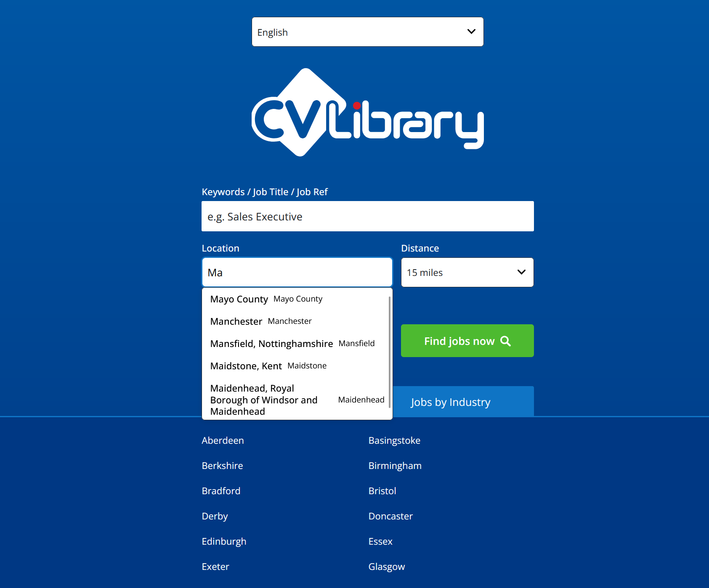
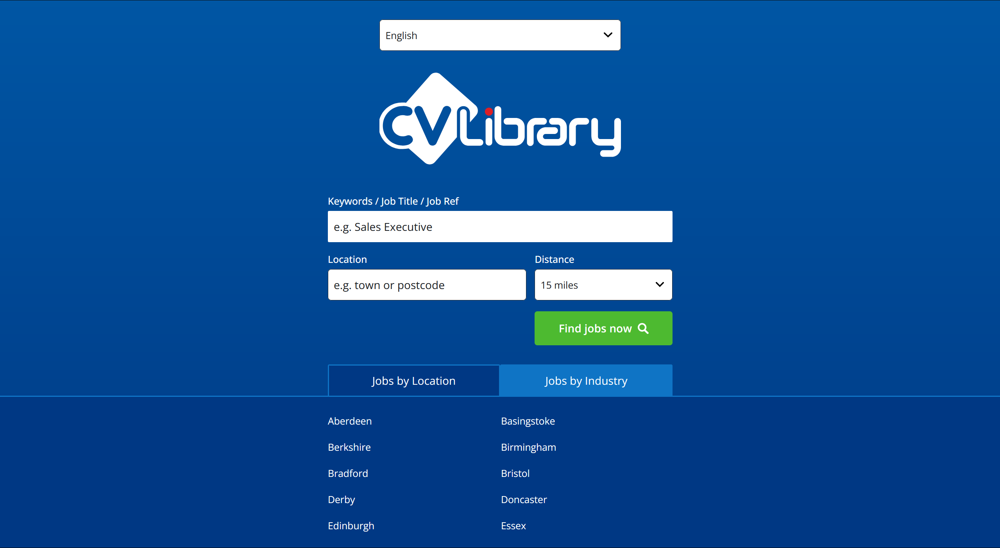
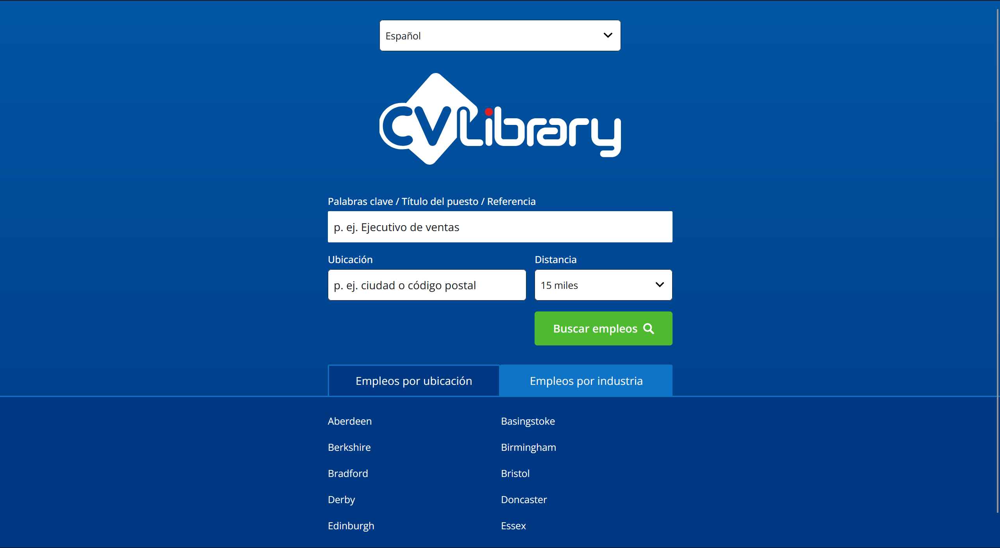
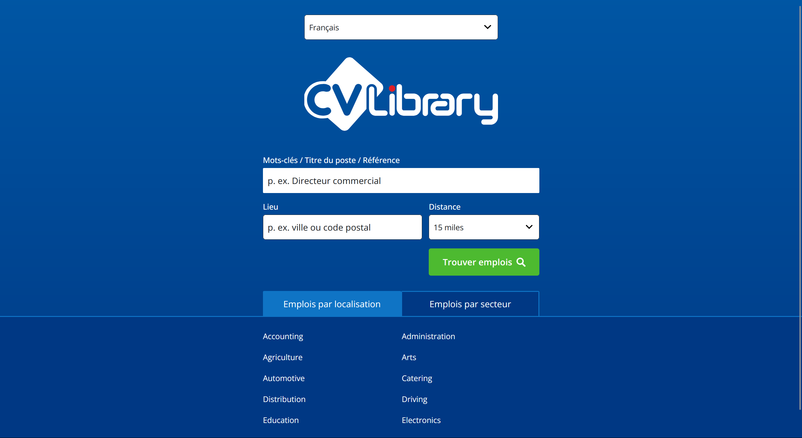
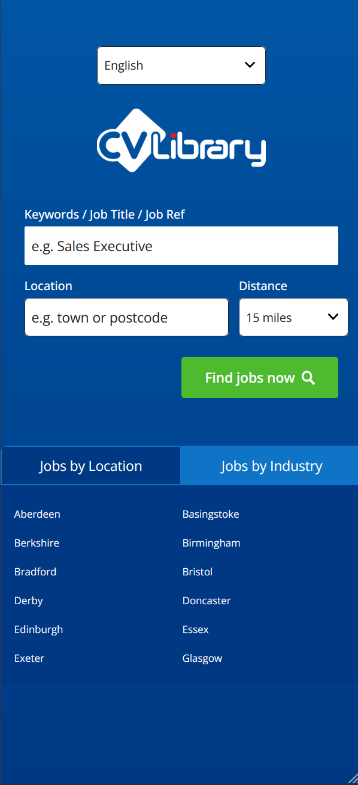
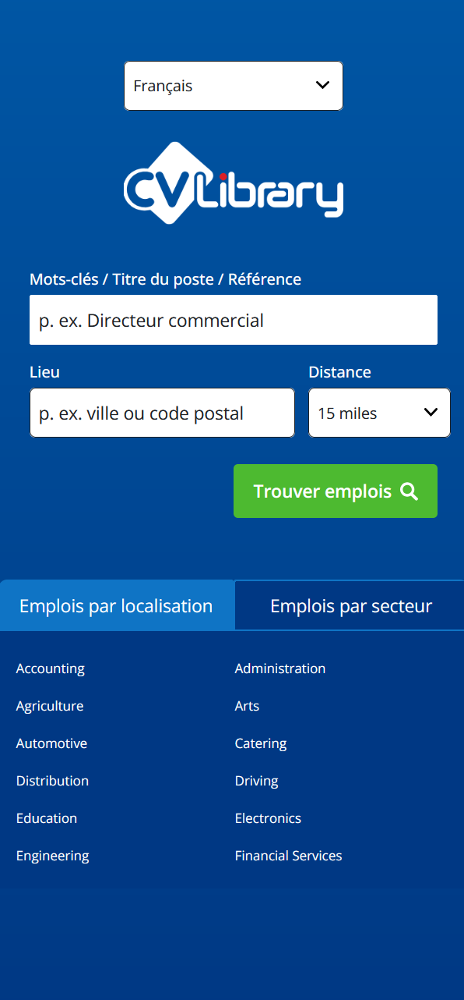

# Library Job Search

A modern job search interface built with Next.js 15 App Router, featuring real-time location autocomplete, multilingual support, and URL-driven state management - powered by a custom CSS design system.



## Architectural Highlights

1. **Compositional UI** - The render props pattern allows component consumers to customize presentation while the core handles complex behaviors
2. **Type-safe interactions** - End-to-end TypeScript integration with discriminated unions ensures robust error handling
3. **Performance optimization** - Server Components for data fetching paired with client interactivity creates an optimal user experience
4. **Internationalization by design** - Built-in multilingual support with locale-specific routing enhances accessibility
5. **State preservation** - URL-driven state management with NUQS enables shareable application states
6. **Resilient data handling** - Robust promise handling with Suspense and fallback mechanisms ensures graceful degradation

### Frontend

- **Next.js 15 App Router**: Server components enable hybrid rendering, fetching location data and passing promises to client components, which unwrap the promises on the client using the `use` hook, optimizing initial load performance while maintaining interactivity.
- **NUQS**: URL-based state management enables shareable search states and seamless server/client synchronization.
- **CSS Modules and CSS Variables**: Custom design system with design tokens using CSS variables, utility classes, and component variants.
- **next-intl**: Internationalization with EN/FR/ES support and locale-specific routing.
- **TypeScript**: End-to-end type safety with discriminated unions for error and success states.

## Key Features

- **Smart Location Autocomplete**:

  - **Headless Component Architecture**:

    - Separation of core logic from UI presentation
    - Accessibility-first design with ARIA attributes
    - Keyboard navigation and focus management

  - **Render Props Pattern**:

    - Complete UI customization through `renderItem` prop
    - Composable with design system components (HStack, Label)
    - State-aware rendering with highlighted/selected indicators

  - **Production-Ready Implementation**:
    - Real-time API integration with location service
    - Elegant loading, error, and empty states with Suspense boundaries
    - Character validation with user feedback
    - Consistent styling with automatic hover states
    - Resilient error handling with graceful fallbacks

- **Multilingual Interface**:

  - Complete internationalization with URL-based locale switching
  - Translation files for English, French, and Spanish
  - Server and client component translation separation

- **Responsive Design**:

  - Mobile-first approach with CSS Grid and flexible layouts
  - Custom spacing system for consistent component relationships
  - Form elements that adapt to different viewport sizes

- **Hybrid Rendering**:
  - Server-side data fetching for optimal loading performance
  - Progressive enhancement with client-side interactivity
  - Streaming with Suspense for improved user experience

## Architectural Decisions

### Feature-Sliced Design-inspired File Structure

The project adopts a simplified version of Feature-Sliced Design (FSD) for code organization:

```
src/
├── features/          # Business domains
│   └── job-search/    # Domain-specific feature
│       ├── ui/        # Presentational components
│       ├── api/       # API clients & queries
│       └── models/    # Type definitions & schemas
├── components/        # Shared UI primitives
├── styles/            # Global styles & design system
└── lib/               # Generic utilities
```

This structure provides clear boundaries between different concerns, enabling:

1. **Better code navigation** by grouping related files
2. **Improved maintainability** through isolation of feature modules
3. **Easier onboarding** for new developers through consistent patterns
4. **Scalability** as new features can be added without affecting existing ones

### Promise Handling with Suspense

The application leverages React 19's modern data fetching patterns with Suspense to create a fluid user experience:

```typescript
// Conceptual flow in AutoComplete component
<Suspense fallback={<LoadingList message="Loading suggestions..." />}>
  <SuggestionsList suggestions={suggestionsPromise} />
</Suspense>
```

This pattern allows for:

1. **Progressive rendering** - The UI is streamed from server to client, allowing users to see and interact with parts of the page while other components are still loading
2. **Decoupled data fetching** - Suspense boundaries isolate loading states to specific components rather than entire pages
3. **Sequential user flows** - Loading states are shown before no-results states, creating a logical progression for users
4. **Use hook integration** - React 19's `use` hook unwraps promises safely within Suspense boundaries
5. **Fallback resiliency** - API failures trigger fallbacks to mock data after simulated delays

The component gracefully handles both static data arrays and promises that resolve to data, providing flexibility in data sourcing while maintaining consistent UI patterns.

### UI State Components

The application implements specialized components for handling different UI states:

```typescript
// Loading state with customizable message and spinner
<LoadingState
  message="Loading content..."
  variant="default"
  size="sm"
  alignment="center"
/>

// Empty state with customizable message and icon
<EmptyState
  message="No results found"
  variant="default"
  size="sm"
  hideIcon={false}
/>
```

These components provide:

1. **Consistent user feedback** - Standardized appearance for loading and empty states
2. **Flexible presentation** - Customizable sizing, alignment, and styling
3. **Accessibility** - Proper ARIA attributes and semantic structure
4. **List variants** - Specialized `LoadingList` and `EmptyList` for dropdown contexts

Together with Suspense boundaries, these components create a cohesive approach to handling asynchronous operations and empty datasets throughout the application.

### Data Transformation Pipeline

The application implements a clear data transformation flow to decouple frontend from backend concerns:

```typescript
// 1. Schema definition validates API response structure
export const LocationsApiResponseSchema = z.array(
  z.object({
    label: z.string(),
    terms: z.array(z.string()),
    displayLocation: z.string(),
  })
);

// 2. Mapper transforms backend DTO to frontend-optimized RTO (mappers.ts)
export interface LocationRTO {
  label: string; // Display text
  value: string; // Form value
}

export function mapLocationDtoToRto(dto: LocationApiDTO): LocationRTO {
  const primaryTerm = dto.terms[0]; // Extract primary term for value
  return {
    label: dto.label,
    value: dto.terms[0], // Extract primary term for value
  };
}

// 3. API layer uses schemas for validation and mappers for transformation (queries.ts)
export async function fetchLocations(query: string): Promise<FetchResult<LocationRTO[]>> {
  // ...fetch implementation
  const data = await response.json();

  // Validate the API response structure using our ZOD schema
  const parsedData = LocationsApiResponseSchema.safeParse(data);

  // If the data is valid, transform it to the RTO format and return it
  return parsedData.success ? handleSuccess(parsedData.data.map(mapLocationDtoToRto)) : handleError("Invalid data format");
  // ...error handling and fallbacks
}

// 4. UI components consume the RTOs (location-search.tsx)
<AutoComplete<LocationRTO>
  suggestions={suggestionsPromise}
  onSelect={(item) => setLocation(item.value)}
  // ...other props
  renderItem={({ item }) => (
    <HStack>
      <Label>{item.label}</Label>
      <Label>{item.value}</Label>
    </HStack>
  )}
/>;
```

This pattern creates a robust frontend architecture:

1. **API contract validation** - Zod schemas ensure API responses match expected structure
2. **Backend isolation** - Changes to API responses only require updates to mappers, not UI components
3. **Frontend optimization** - RTOs contain only data needed by UI components
4. **Graceful degradation** - Error handling with mock data fallbacks
5. **Type safety** - TypeScript ensures correct data usage throughout the application

### URL-Driven State with NUQS and Hybrid Rendering

The application combines URL-based state management with Next.js 15's hybrid rendering for a powerful developer and user experience:

```typescript
// URL state definition
export const searchParamsObject = {
  location: parseAsString.withDefault("").withOptions({
    throttleMs: 750, // Debounce user input
    shallow: false, // Server participates when URL changes
  }),
};
```

This approach creates several key advantages:

1. **Stateful URLs** - When a user shares `http://library.teeldinho.co.za/en?location=Great`, the recipient receives a page with pre-populated state
2. **Hydration optimization** - Next.js recognizes URL parameters and can pre-fetch data server-side before sending HTML
3. **Reduced loading states** - When navigating to a URL with parameters, loading states may be minimized or eliminated entirely as data is already available
4. **Seamless transitions** - Server Components can prepare data based on URL parameters before client hydration
5. **State persistence** - Browser history navigation preserves application state without additional client-side code

For example, when a user selects "Great Yarmouth" from the location dropdown, `setLocation("Great Yarmouth")` updates the URL to `?location=Great%20Yarmouth`. If this URL is shared, Next.js can use this parameter to fetch location data server-side, potentially eliminating loading indicators entirely for the recipient.

This pattern exemplifies Next.js 15's "full-stack to the frontend" approach, where server and client collaborate to optimize both initial and subsequent page loads.

### Git Workflow Strategy

The project employs GitHub Flow, a simplified Git branching strategy that's ideal for smaller teams or solo developers:

```
main         ○─────○─────○─────○─────○
              \     \     \     /     /
feature-1      ○─────○─────○───○
                      \         /
feature-2               ○───○──○
                               \
hotfix-1                        ○───○
```

Key aspects of this approach:

1. **Single production branch** (`main`) - Always deployable and protected
2. **Feature branches** - Created for new features, merged via pull requests
3. **Hotfix branches** - Created for urgent production fixes
4. **No develop branch** - Simplifies the workflow for smaller teams
5. **Pull request reviews** - Code quality gate before merging to main

This simplified workflow provides adequate structure while eliminating the overhead of more complex strategies like GitFlow, which is more suitable for larger teams with coordinated release cycles.

### Design System with CSS Variables

The project implements a comprehensive design system using CSS custom properties instead of a UI framework like Tailwind:

```css
/* Scale-based tokens in tokens.css */
:root {
  --primary-300: oklch(55% 0.15 250);
  --space-md: 0.75rem;
  --text-lg: 1rem;
  --form-element-height: 2.8125rem;
}
```

This approach provides several benefits:

1. **Visual consistency** through centralized design tokens
2. **Reduced bundle size** by avoiding external UI libraries
3. **Improved performance** with native CSS instead of utility class processing
4. **Better maintainability** through semantic variable naming

### Headless Component Pattern

The application implements a powerful headless component pattern for the autocomplete functionality:

```typescript
// Core functionality without UI (auto-complete-headless.tsx)
export function AutocompleteHeadless<T extends AutocompleteSuggestion>({
  onSelect,
  inputValue,
  onInputChange,
  itemToString,
  children,
}: AutocompleteHeadlessProps<T>) {
  const [isOpen, setIsOpen] = useState(false);
  const [highlightedIndex, setHighlightedIndex] = useState<number | null>(null);

  // State and behavior logic...

  return children({
    inputProps: {
      id: inputId,
      value: inputValue,
      onChange: handleInputChange,
      onKeyDown: handleKeyDown,
      onFocus: () => setIsOpen(true),
      // More accessibility attributes...
    },
    listProps: {
      id: listId,
      role: "listbox",
    },
    getItemProps,
    isOpen,
    highlightedIndex,
  });
}

// Implementation with UI (auto-complete.tsx)
<AutocompleteHeadless suggestions={suggestions} onSelect={onSelect} inputValue={inputValue} onInputChange={onInputChange} itemToString={itemToString}>
  {({ inputProps, listProps, getItemProps, isOpen, highlightedIndex }) => (
    <div className={styles.autocomplete}>
      {label && <Label htmlFor={inputProps.id}>{label}</Label>}
      <input {...inputProps} className={styles.input} placeholder={placeholder} />

      {isOpen && hasMinChars(inputValue) && (
        <div className={styles.suggestionsContainer}>
          <Suspense fallback={<LoadingList message={t("loadingSuggestions")} />}>
            <SuggestionsList
              suggestions={suggestions}
              // Other props...
              renderItem={renderItem}
            />
          </Suspense>
        </div>
      )}
    </div>
  )}
</AutocompleteHeadless>;
```

This pattern offers several key advantages:

1. **Separation of concerns** - Core logic (keyboard navigation, state management) is isolated from the UI presentation
2. **Accessibility by default** - ARIA attributes and keyboard interactions are handled by the headless component
3. **Flexible UI customization** - The `renderItem` prop enables complete control over suggestion appearance
4. **Progressive enhancement** - Suspense integration enables elegant loading and empty states
5. **Type safety** - Generic typing ensures consistent data handling throughout the component hierarchy

The headless pattern creates a robust foundation that can be styled differently across the application while maintaining consistent behavior and accessibility.

### Type-Safe API Layer

The application implements a robust pattern for API interactions:

```typescript
// Discriminated union type for success/error states
export type FetchResult<T> = { status: "success"; data: T } | { status: "error"; message: string };

// Helper functions enforce the correct Success shape
export const handleSuccess = <T>(data: T): FetchResult<T> => ({
  status: "success",
  data,
});

// Helper functions enforce the correct Error shape
export const handleError = (message: string): FetchResult<never> => ({
  status: "error",
  message,
});
```

This pattern provides several benefits:

1. **Compile-time error checking** prevents invalid state combinations
2. **Exhaustive pattern matching** with TypeScript ensures all cases are handled
3. **Consistent error handling** across the application
4. **Self-documenting code** clearly shows possible outcomes

### Internationalization Strategy

The application uses next-intl for localization:

```typescript
// Locale detection and message loading
export default getRequestConfig(async ({ requestLocale }) => {
  const locale = hasLocale(routing.locales, requested) ? requested : routing.defaultLocale;

  return {
    locale,
    messages: (await import(`../../src/messages/${locale}.json`)).default,
  };
});
```

The i18n implementation provides:

1. **Server-side rendering** of translated content improves SEO
2. **Locale-specific URLs** for better user experience
3. **Message separation** for easier translation management
4. **Dynamic loading** of translation files only when needed

## Areas for Improvement

- **Advanced Search Options**: Implement additional filtering criteria for job searches
- **Saved Searches**: Allow users to save and manage their frequent searches
- **Automated Testing**: Implement E2E and component tests with Playwright and Vitest

## Getting Started

First, run the development server:

```bash
npm run dev
```

Open [http://localhost:3000](http://localhost:3000) with your browser to see the result.

Alternatively, you can access the live application [here](https://library.teeldinho.co.za/).

## Screenshots








## Conclusion

This project demonstrates a comprehensive approach to modern web application architecture by integrating several key patterns and technologies:

1. **Decoupled UI architecture** - Headless components separate logic from presentation, improving flexibility and maintainability while enabling design system consistency

2. **Resilient data handling** - A pipeline of schemas → DTOs → mappers → RTOs creates a robust barrier against API changes and ensures type safety

3. **State synchronization** - URL-based state management with NUQS enables seamless server/client synchronization, shareable application states, and improved navigation

4. **Progressive enhancement** - Server components fetch data that client components consume, striking an optimal balance between performance and interactivity

5. **Developer experience** - GitHub Flow simplifies collaboration while maintaining code quality through pull requests

6. **User experience** - Careful attention to loading states, error handling, and empty states ensures a polished interface regardless of network conditions

The combination of these patterns creates a foundation that balances technical excellence with practical considerations, resulting in an application that performs well for users while remaining maintainable for developers. The architecture scales naturally to accommodate more complex features while preserving the established patterns.
